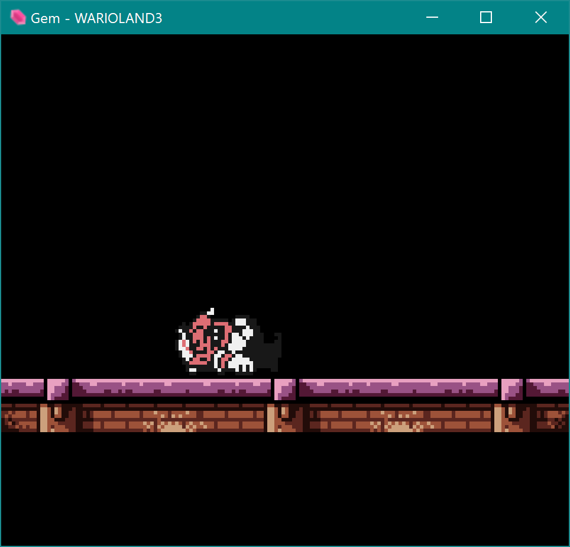
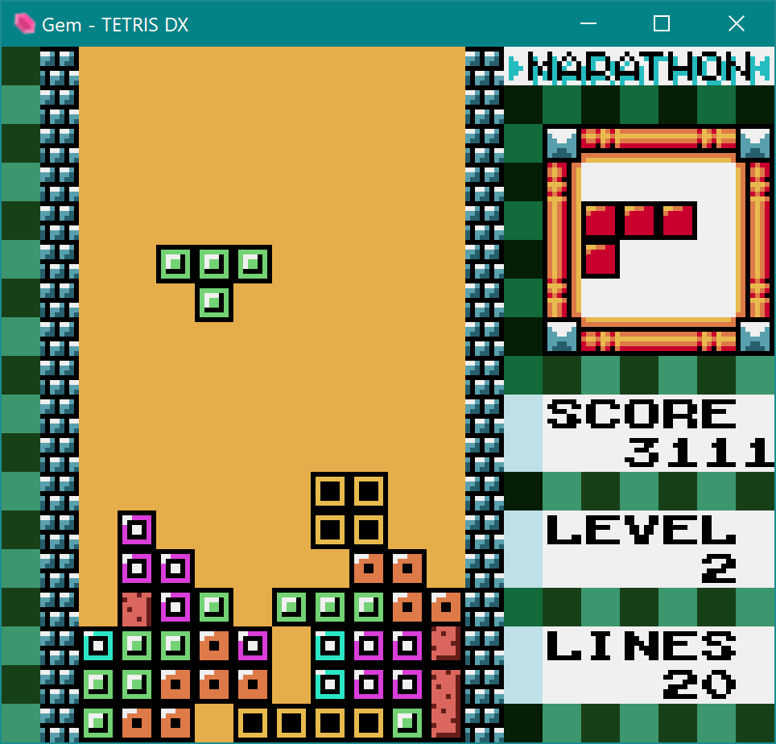
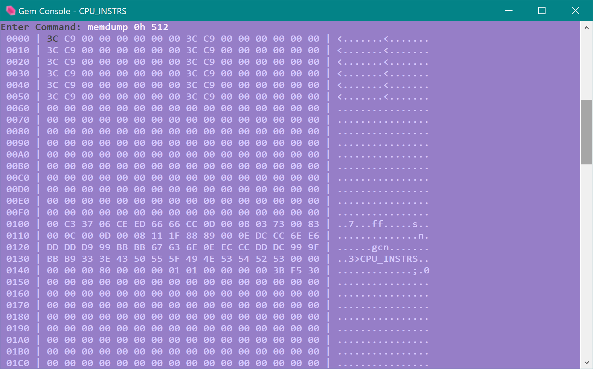

# Gem - Game Boy Color Emulator

## Features
- A slew of commands for debugging the emulation. See table below.
- Easy to read code. Highly modularized design and liberal usage of comments makes it a good reference for writing your own emulator.

## Debug Commands
*Note: Any numeric argument can be suffixed with 'h' to indicate a hex number (e.g. 204 -> CCh)*
| Command | Syntax | Description |
| --- | --- | --- |
| Open| `o\|open [file]` | Load a new ROM file. Files can also be dragged and dropped over the window. |
| Run | `run\|play` | Run the emulation. |
| Pause  | `pause` | Pause the emulation. |
| Reset| `reset` | Reset emulation state as if the ROM was just loaded. |
| Save Game  | `save` | If the ROM type has external RAM or a real-time clock, their states are saved to disk (automatically happens on shutdown too). |
| Exit  | `exit` | Close the emulator (can also close the console or viewport windows instead) |
| Print Info  | `p\|print cpu\|gpu\|rom\|timers` | Print the state of one of the components to the console. |
| Stepping  | `step \| stepn n \| vblank` | Tick the core once, `n` times or until a vblank occurs. Emulation must be paused first. |
| Toggle Breakpoint  | `bp addr 0\|1` | Set or unset (depending on second arg) a breakpoint at the given address. |
| Delete Breakpoint  | `bp addr del` | Delete the breakpoint so it's no longer being checked. |
| List Breakpoints  | `bp` |  |
| Toggle Memory Breakpoints | `wbp\|rbp addr [value]` | Pause/break when a write or read occurs at the given address. If a value is given it must match what's being written or read. |
| Delete Memory Breakpoints | `wbp\|rbp addr del` | Delete the breakpoint so it's no longer being checked. |
| List Memory Breakpoints | `wbp\|rbp` |  |
| Memory Dump | `memdump addr n` | Print out a hex dump of `n` bytes of memory at the given address. |
| Colour Correction | `ccm 0\|1` | 0: washout colours similar to the physical LCD screen, 1: multiply by 8 (more vibrant colours) |
| Brightness | `brightness 1.0-` | Set a brightness factor (colur channels are multiplied by this number) |
| GPU Debug Views  | `show\|hide tiles\|palettes\|sprites` | Show or hide one of the debug GPU's debug views. |
| Toggle Sound Channels | `chan 0\|1\|2\|3 0\|1` | Turn one of the four sound channels on or off. |
| Muting | `mute\|unmute` |  |
| Trace Files | `trace 0\|1` | Start or stop appending to a trace file that records the cpu's state (file saved to cwd ). |
| Screenshot | `screenshot [filepath]` | Save a 160x144 bmp screenshot to the given path (or save it to cwd with a random name if no path is given). |

## Command Line Options
*Note: These need to be passed in when launching gem.exe.*
| Arg | Description |
| --- | --- |
| `--vsync` | Synchronize GPU presents with the display's refresh rate. |
| `--no-sound` | APU is not initialized and isn't ticked at all. |
| `--dmg` | Emulate DMG hardware instead of the CGB. |
| `--pause` | Pause after loading a ROM file. |
| `--res-scale=...` | Multiply the window size by an integer to increase its size |

## Keyboard Mapping
| Game Boy | Keyboard |
| --- | --- |
| Arrow buttons | Arrow keys |
| A | Space |
| B | Left Shift |
| Start | Enter |
| Select | Back Slash ('\\') |

## Screenshots

## Code Layout
- **gem.core**: All the hardware emulation logic is in this library. It has no dependencies and is written in portable C++.
- **gem.cmd**: A terminal/console front-end for the core that includes a bunch of commands for debugging the emualation. SDL2 and SDL_ttf are used for audio/video and it only builds on windows for now.

## Projects
- [SDL2](https://www.libsdl.org/download-2.0.php)
- [SDL_ttf](https://www.libsdl.org/projects/SDL_ttf/) + [FreeType](https://www.freetype.org/index.html)
- [Boost](https://www.boost.org/)
- [Cascadia Code font](https://github.com/microsoft/cascadia-code)

Thank you :)