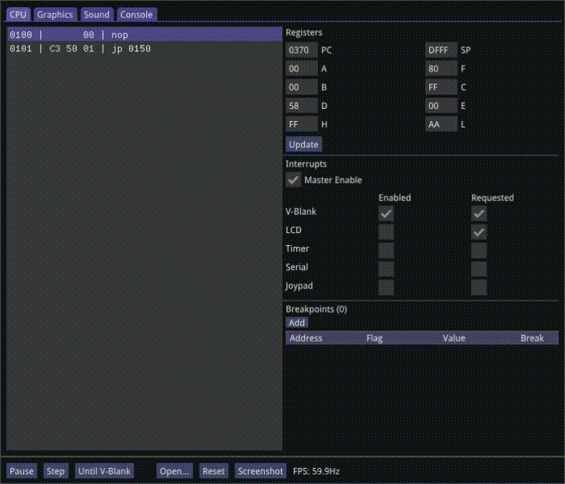

 <h1>Gem - Game Boy Color Emulator & Debugger<h1>

## Features
- Disassembler/debugger
- Visualizations for tiles, sprites and palette colours
- Rewind mode
- Levels visualizer for the 4 sound channels
- Plot for channel 4 wave pattern
- A command console with some commands for debugging the emulation. See table below.
- Easy to read code. Highly modularized design and liberal usage of comments makes it a good reference for writing your own emulator.

</img>

</img>

## Console Commands
*Note: Any numeric argument can be suffixed with 'h' to indicate a hex number (e.g. 204 -> CCh)*
| Command | Syntax | Description |
| --- | --- | --- |
| Open| `o\|open [file]` | Load a new ROM file. Files can also be dragged and dropped over the window. |
| Run | `run\|play` | Run the emulation. |
| Pause  | `pause` | Pause the emulation. |
| Reset| `reset` | Reset emulation state as if the ROM was just loaded. |
| Save Game  | `save` | If the ROM type has external RAM or a real-time clock, their states are saved to disk (automatically happens on shutdown too). |
| Rewind stats  | `rwstats` | Print some rewind-mode stats to the console |
| Exit  | `exit` | Close the emulator (can also close the console or viewport windows instead) |
| Print Info  | `p\|print cpu\|gpu\|rom\|timers` | Print the state of one of the components to the console. |
| Stepping  | `step \| stepn n \| vblank` | Tick the core once, `n` times or until a vblank occurs. Emulation must be paused first. |
| Toggle Breakpoint  | `bp addr 0\|1` | Set or unset (depending on second arg) a breakpoint at the given address. |
| Toggle Memory Breakpoints | `wbp\|rbp addr [value]` | Pause/break when a write or read occurs at the given address. If a value is given it must match what's being written or read. |
| Delete Breakpoint  | `bp\|wbp\|rbp addr del` | Delete the breakpoint so it's no longer being checked. |
| List Breakpoints  | `bp\|wbp\|rbp` |  |
| Memory Dump | `memdump addr n` | Print out a hex dump of `n` bytes of memory at the given address. |
| Colour Correction | `ccm 0\|1` | 0: washout colours similar to the physical LCD screen, 1: multiply by 8 (more vibrant colours) |
| Brightness | `brightness 1.0-` | Set a brightness factor (colur channels are multiplied by this number) |
| GPU Debug Views  | `show\|hide tiles\|palettes\|sprites` | Show or hide one of the debug GPU's debug views. |
| Toggle Sound Channels | `chan 1\|2\|3\|4 0\|1` | Turn one of the four sound channels on or off. |
| Muting | `mute\|unmute` |  |
| Trace Files | `trace 0\|1` | Start or stop appending to a trace file that records the cpu's state (file saved to cwd ). |
| Screenshot | `screenshot [filepath]` | Save a 160x144 bmp screenshot to the given path (or save it to cwd with a random name if no path is given). |

## Configuration
A config file named `gem.ini` is used to persist some user settings. It's created the first time you run the emulator and can then be modified.
| Config Key | Description |
| --- | --- |
| VSync | Synchronize GPU presents with the display's refresh rate. |
| ResolutionScale | Multiply the window size by an integer to increase its size. |
| \*Key | A keyboard key to map the Game Boy button to. See [SDL_Keycode](https://wiki.libsdl.org/SDL_Keycode). |
| DMGPalette | A '\|' delimited list of four colours for the DMG palette (starting with white/colour 0). Each colour can be formated using `rgb(x,x,x)` or as a 24-bit hex number: `FFCFEAh`. E.g. `DMGPalette=F7FBE1h\|BAC964h\|438A5Eh\|436F8Ah` |

## Rewind Mode
To rewind gameplay press and hold the `R` key then release when you want to stop. Hold down the `T` key while releasing `R` to continue from the start of the rewind (i.e. discard the rewind operation). 
When enabled this feature will save a snapshot of the last N seconds of game play allowing you to rewind to a previous state. 

</img>

| Config Key | Description |
| --- | --- |
| RewindBufferDuration | How many seconds of game play to save to the rewind buffer. |
| RewindFramesBetweenSnapshots | How many frames to skip before taking a rewind snapshot. |
| RewindEnabled | Enable or disable the rewind feature and buffer. |

## Command Line Options
*Note: These need to be passed in when launching gem.exe.*
| Arg | Description |
| --- | --- |
| `--vsync` | Synchronize GPU presents with the display's refresh rate. |
| `--no-sound` | APU is not initialized and isn't ticked at all. |
| `--dmg` | Emulate DMG hardware instead of the CGB. |
| `--pause` | Pause after loading a ROM file. |
| `--res-scale=...` | Multiply the window size by an integer to increase its size. |

## Keyboard Mapping
| Game Boy | Keyboard |
| --- | --- |
| Arrow buttons | Arrow keys |
| A | A |
| B | S |
| Start | Enter |
| Select | Left shift |

## Code Layout
- **gem.core**: All the hardware emulation logic is in this library. It has no dependencies and is written in portable C++.
- **gem.gui**: A UI front-end and debugger for the emultation core. The main window uses just SDL2 while the debugger is written with ImGui.

## Projects
- [SDL2](https://www.libsdl.org/download-2.0.php)
- [Dear ImGui](https://github.com/ocornut/imgui)
- [FFmpeg](https://ffmpeg.org/)
- [BGB Emulator Debugger](https://bgb.bircd.org/) - super useful during the development of gem.
- Droid Sans font
